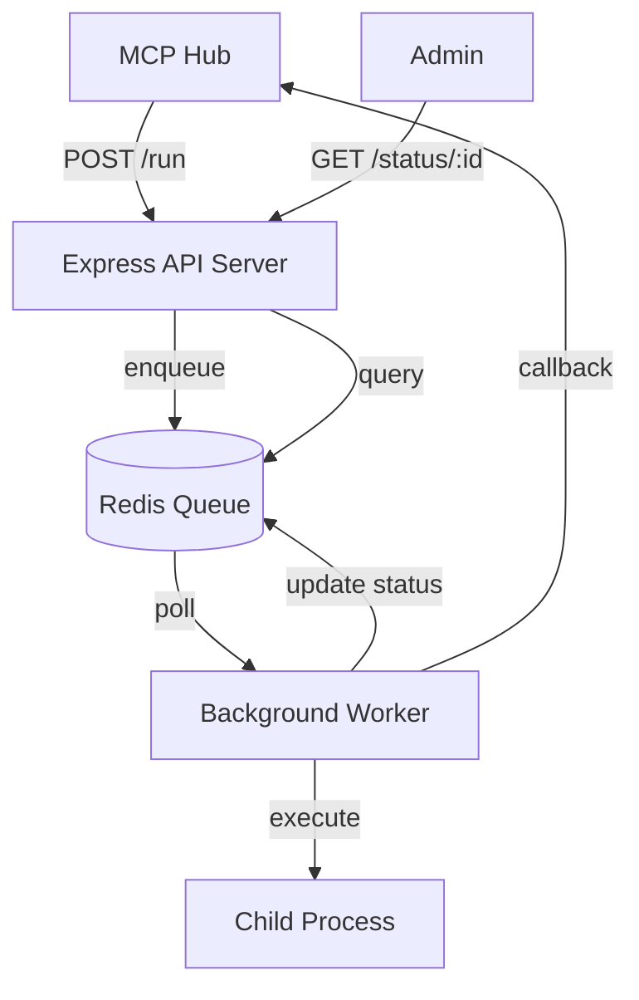
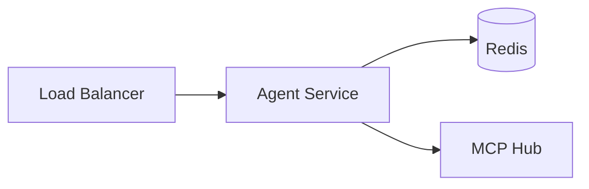
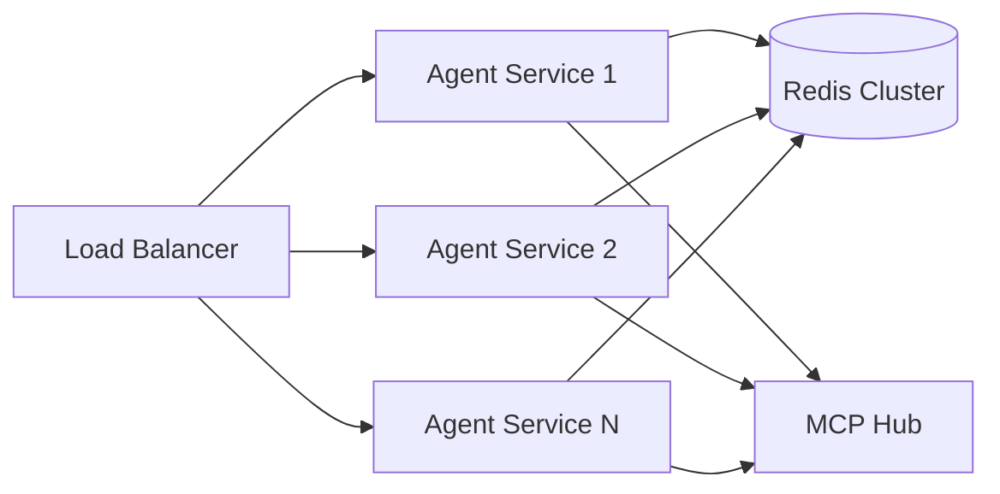

# Design Document

## Overview

The Agent Service is designed as a lightweight, scalable Node.js application that processes build jobs in a distributed MCP system. The architecture follows a producer-consumer pattern where HTTP endpoints receive jobs, Redis acts as a message queue, and a background worker processes jobs asynchronously. The service is built with modularity in mind, separating concerns between HTTP handling, queue management, and job execution.

## Architecture

The system follows a three-tier architecture:

1. **HTTP Layer**: Express.js server handling REST API endpoints
2. **Queue Layer**: Redis-based job queue with status tracking
3. **Worker Layer**: Background process for job execution using child processes



## Components and Interfaces

### 1. HTTP Server (src/index.js)

**Purpose**: Main entry point providing REST API endpoints

**Key Responsibilities**:
- Initialize Express server with middleware
- Handle job submission via POST /run
- Provide job status queries via GET /status/:jobId
- Manage server lifecycle and graceful shutdown

**Interface**:
```javascript
// POST /run
Request: { jobId: string, command: string }
Response: { jobId: string, status: "queued" }

// GET /status/:jobId
Response: { jobId: string, status: string, logs?: string[] }
```

### 2. Queue Manager (src/queue.js)

**Purpose**: Abstracts Redis operations for job queue management

**Key Responsibilities**:
- Establish and maintain Redis connection
- Provide job queue operations (enqueue, dequeue, status updates)
- Handle Redis connection errors and reconnection
- Store job metadata and execution logs

**Interface**:
```javascript
class QueueManager {
  async enqueueJob(jobId, command)
  async dequeueJob()
  async updateJobStatus(jobId, status, logs)
  async getJobStatus(jobId)
  async close()
}
```

**Redis Data Structure**:
- Job Queue: `jobs:queue` (Redis List)
- Job Status: `job:{jobId}:status` (Redis String)
- Job Logs: `job:{jobId}:logs` (Redis List)
- Job Data: `job:{jobId}:data` (Redis Hash)

### 3. Worker Process (src/worker.js)

**Purpose**: Background job processor that executes commands

**Key Responsibilities**:
- Continuously poll Redis queue for new jobs
- Execute job commands using child_process.exec
- Capture and store execution logs
- Send status updates to MCP Hub
- Handle job timeouts and failures

**Interface**:
```javascript
class Worker {
  async start()
  async stop()
  async processJob(job)
  async executeCommand(command)
  async sendHubUpdate(jobId, status, logs)
}
```

## Data Models

### Job Object
```javascript
{
  jobId: string,           // Unique identifier
  command: string,         // Shell command to execute
  status: string,          // "queued" | "running" | "completed" | "failed"
  createdAt: Date,         // Job creation timestamp
  startedAt?: Date,        // Execution start time
  completedAt?: Date,      // Execution completion time
  logs: string[]           // Execution output lines
}
```

### Hub Callback Payload
```javascript
{
  jobId: string,
  status: string,
  logs: string[],
  completedAt: string
}
```

## Error Handling

### HTTP Layer Errors
- **400 Bad Request**: Invalid job payload or missing required fields
- **404 Not Found**: Job ID not found in status queries
- **500 Internal Server Error**: Redis connection failures or unexpected errors
- **503 Service Unavailable**: Redis unavailable during job submission

### Worker Process Errors
- **Command Execution Failures**: Captured as job logs, status set to "failed"
- **Redis Connection Errors**: Logged with retry mechanism
- **Hub Callback Failures**: Logged but don't block job processing
- **Timeout Handling**: Jobs exceeding timeout threshold marked as failed

### Redis Connection Handling
- Automatic reconnection with exponential backoff
- Graceful degradation when Redis is unavailable
- Connection health monitoring and logging

## Testing Strategy

### Unit Tests
- Queue operations (enqueue, dequeue, status updates)
- Job execution simulation with mocked child_process
- HTTP endpoint validation and error handling
- Configuration loading and validation

### Integration Tests
- End-to-end job flow from submission to completion
- Redis integration with real Redis instance
- Hub callback integration with mock HTTP server
- Error scenarios and recovery testing

### Performance Considerations
- Redis connection pooling for high throughput
- Job execution timeout to prevent hanging processes
- Memory management for job logs (log rotation/cleanup)
- Graceful shutdown handling for in-flight jobs

## Configuration Management

### Environment Variables
```bash
PORT=4000                                    # HTTP server port
REDIS_URL=redis://localhost:6379            # Redis connection string
HUB_URL=http://localhost:3000/hub/update-status  # Hub callback endpoint
JOB_TIMEOUT=300000                          # Job timeout in milliseconds (optional)
POLL_INTERVAL=1000                          # Queue polling interval (optional)
LOG_LEVEL=info                              # Logging level (optional)
```

### Configuration Validation
- Required variables checked at startup
- Default values provided for optional settings
- Clear error messages for missing configuration
- Environment-specific configuration support

## Security Considerations

### Command Execution Safety
- Input validation for job commands
- Command sanitization to prevent injection
- Resource limits for child processes
- Timeout enforcement to prevent DoS

### Network Security
- HTTPS support for Hub callbacks
- Request validation and rate limiting
- Secure Redis connection (TLS support)
- Environment variable protection

## Deployment Architecture

### Single Instance Deployment


### Multi-Instance Deployment


### Scalability Features
- Stateless design enables horizontal scaling
- Redis-based coordination prevents job duplication
- Independent worker processes for parallel execution
- Load balancer support for multiple instances